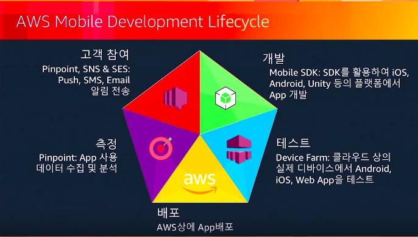

amplify : 새로운 자바스크립트 라이브러리 

하이브리드 어플리케이션을 개발할 수 있는 가장 강력한 도구

자바스크립트를 사용하는 가장 일반적인 예인 웹 어플리케이션을 개발하는 데에도 사용할 수 있음

그 동안은 하나의 어플리케이션을 만들 때 마다 여러가지 플랫폼의 각각 다른 라이브러리와 프레임워크들을 공부한 후 개발해야 했음

aws 조사에 따르면 신규로 개발되고 있는 엔터프라이즈 어플리케이션은 거의 대부분 웹 기술을 기반으로 한다고 함

- 50%가 넘는 어플리케이션들이 웹 기반의 어플리케이션으로 만들어지고 있다
  - = 자바스크립트의 인기가 높아지고 있다

개발 —> 디바이스 팜으로 테스트 —> aws상 배포 —> 백엔드가 필요하면 람다/다이나모DB 이용해서 구성 (그러나 이런 것들이 통합되어 있지는 않았음) —> 모바일 앱 사용자 경험을 계속 모니터링, 측정, 데이터 수집할 플랫폼 핀포인트 사용 —> 타겟 마케팅 등...

모바일 개발자들은 백엔드와 친하지 않음. aws 기술도 모르는 개발자들이 많다!

—> 이러한 것들을 편하게 할 수 없을까? —> 모바일 허브 서비스

: 앞에 나열했던 여러가지 aws 리소스들을 편하게 한곳에서 enable 후 사용 가능

여기서 생성된 리소스들을 Native SDK 들을 통해 불러와서 사용

자바스크립트를 사용하는 개발자가 점점 늘어남

- 자바스크립트 sdk도 제공을 하고 있었는데
- 보다 사용하기 편한 새로운 라이브러리 AWS Amplify 출시

이 라이브러리에서 손쉽게 모바일 허브 리소스들을 생성하고, 프로젝트 로컬 환경에서 손쉽게 모바일 허브 프로젝트를 만들고 그 프로젝트 환경들을 우리들의 코드에 반영할 수 있도록, cli 도구를 추가

— 여기까지가 한 9,10월까지 개발의 모습이였다면 많이 바뀜

Mobile Hub —> CloudFormation (범용성이 더 높음)

Mobile CLI —> Amplify CLI (사용법은 유사하지만 모바일 외에도 aws 거의 모든 서비스 사용가능)

amplify
: 단순히 자바스크립트를 sdk 형태로 제공하는 것이 아니라 일반적인 자바스크립트나 유명한 프레임워크인 리액트, 리액트 네이티브, 앵귤러, 아이오닉, 뷰 등을 제공, 각각의 프레임워크별로 extension 제공

—> 보다 편리하게 이용할 수 있는 라이브러리!

이전에 사용하던 모바일 허브와 모바일 CLI도 아직 계속 사용이 가능하다.

모바일 허브 : aws 웹 콘솔 - 모바일 허브 메뉴에 들어가서, GUI 상에서 하나하나 기능들을 추가/삭제 할 수 있음. GUI상에서 구성한 것들을 우리의 프로젝트 경로에서 `awsmoblie pull` 하면 프로젝트에 그 리소스 정보들이 다 들어옴. 그 리소스들을 뒤에서 amplify 라이브러리를 통해 불러서 사용하는 구조 

(내부에서 바로 사용하고 싶으면 `awsmobile init` 로 초기화, `awsmobile user-signin enable ` 등 사용, 

`awsmobile push`  하면 그 설정 그대로 aws 클라우드 상에 인프라가 생김)

### 지원하는 서비스

* User-signin (Amazon Cognito)
  * 로그인, 회원가입 ...
* analytics (Amazon Pinpoint)
* database (Amazon DynamoDB)
  * database api 만들기
* user-files (Amazon S3)
  * 유저의 파일을 클라우드에 올리기
* cloud-api (API GW & AWS Lambda)

—> 이런 기능들은 enable 명령만으로 바로바로 사용 가능

* web app 배포 지원
  * hosting (Amazon S3, Amazon CloudFront)

이렇게 만들어진 인프라를 자바스크립트 amplify library라는 항목에서 지원

 amplify library

* declarative interfaces —> 직관적
* 

src/app.js 에 

tableName 변수를 위해  todosTable -> todos

 다이나모 디비 리소스 만들 때 우리가 todosTable을 리소스 네임으로 정하고 todos를 테이블 네임으로 정했는데, 그래서 이게 둘이 파일이 생길 때 이름이 바뀌어서 사용됨. 이게 나중의 CLI 버전에서는 수정될것으로 보이나… 

첫 route 정의를 아래 코드로 바꾸시오

